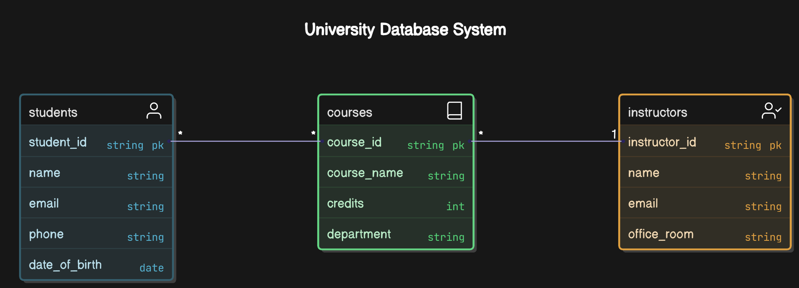

# University Database System

## Entities and Attributes

### Students
- **Student_ID**: Unique identifier for each student
- **Name**: Full name of the student
- **Email**: Contact email of the student
- **Phone**: Contact phone number of the student
- **Date_of_Birth**: Birth date of the student

### Courses
- **Course_ID**: Unique identifier for each course
- **Course_Name**: Name of the course
- **Credits**: Number of credits the course offers
- **Department**: Department offering the course

### Instructors
- **Instructor_ID**: Unique identifier for each instructor
- **Name**: Full name of the instructor
- **Email**: Contact email of the instructor
- **Office_Room**: Office location of the instructor

## Relationships

### Students and Courses
- **Relationship Type**: Many-to-Many
- **Description**: Each student can enroll in multiple courses, and each course can have multiple students.

### Courses and Instructors
- **Relationship Type**: One-to-Many
- **Description**: Each course is taught by exactly one instructor, but an instructor can teach multiple courses.

## ER Diagram
Below is the Entity-Relationship (ER) diagram for the university database system:

